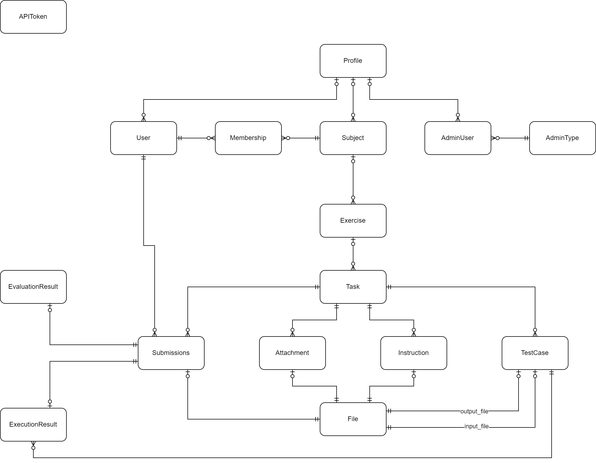

# Datamodel
In order to understand the datamodel of the CodeGrader a little bit faster you can find a listing and short description of all tables in the database (out of postgres psql)


## Tables
```
               List of relations
 Schema |       Name       | Type  |   Owner
--------+------------------+-------+------------
 public | admin_type       | table | codeGrader
 public | adminuser        | table | codeGrader
 public | attachment       | table | codeGrader
 public | evaluation_type  | table | codeGrader
 public | evaluationresult | table | codeGrader
 public | executionresult  | table | codeGrader
 public | exercise         | table | codeGrader
 public | file             | table | codeGrader
 public | instruction      | table | codeGrader
 public | membership       | table | codeGrader
 public | profile          | table | codeGrader
 public | subject          | table | codeGrader
 public | submission       | table | codeGrader
 public | task             | table | codeGrader
 public | testcase         | table | codeGrader
 public | token            | table | codeGrader
 public | user             | table | codeGrader
(17 rows)
```

In general all tables will include 3 metadata columns. 
- id: Primary Key of the table and auto generated by the database
- creation_dts: DateTime stamp of the database when the object has last been created. 
- updated_dts: DateTime stamp of the database when te object has last been updated. 


## Admin Type
The admin type specifies the rights that an admin has within the admin frontend.
```
                                        Table "public.admin_type"
    Column    |           Type           | Collation | Nullable |                Default
--------------+--------------------------+-----------+----------+----------------------------------------
 id           | integer                  |           | not null | nextval('admin_type_id_seq'::regclass)
 creation_dts | timestamp with time zone |           | not null | now()
 updated_dts  | timestamp with time zone |           | not null | now()
 name         | character varying        |           | not null |
 description  | character varying        |           |          |
Indexes:
    "admin_type_pkey" PRIMARY KEY, btree (id)
    "ix_admin_type_id" btree (id)
    "ix_admin_type_name" UNIQUE, btree (name)
Referenced by:
    TABLE "adminuser" CONSTRAINT "adminuser_admin_type_fkey" FOREIGN KEY (admin_type) REFERENCES admin_type(id)

```

## Admin User
Stores the user Object of an Administrator User for the admin frontend. 
```
                                        Table "public.adminuser"
    Column    |           Type           | Collation | Nullable |                Default
--------------+--------------------------+-----------+----------+---------------------------------------
 id           | integer                  |           | not null | nextval('adminuser_id_seq'::regclass)
 creation_dts | timestamp with time zone |           | not null | now()
 updated_dts  | timestamp with time zone |           | not null | now()
 username     | character varying        |           | not null |
 first_name   | character varying        |           | not null |
 last_name    | character varying        |           | not null |
 email        | character varying        |           | not null |
 password     | character varying        |           | not null |
 tag          | character varying        |           |          |
 admin_type   | integer                  |           | not null |
 profile_id   | integer                  |           |          |
Indexes:
    "adminuser_pkey" PRIMARY KEY, btree (id)
    "ix_adminuser_admin_type" btree (admin_type)
    "ix_adminuser_id" btree (id)
    "ix_adminuser_profile_id" btree (profile_id)
    "ix_adminuser_username" UNIQUE, btree (username)
Foreign-key constraints:
    "adminuser_admin_type_fkey" FOREIGN KEY (admin_type) REFERENCES admin_type(id)
    "adminuser_profile_id_fkey" FOREIGN KEY (profile_id) REFERENCES profile(id)

```

## Attachment
Table to store the properties of a file stored in the file table for additional files of a task. 
```
                                        Table "public.attachment"
    Column    |           Type           | Collation | Nullable |                Default
--------------+--------------------------+-----------+----------+----------------------------------------
 id           | bigint                   |           | not null | nextval('attachment_id_seq'::regclass)
 creation_dts | timestamp with time zone |           | not null | now()
 updated_dts  | timestamp with time zone |           | not null | now()
 task_id      | bigint                   |           |          |
 file_id      | bigint                   |           |          |
Indexes:
    "attachment_pkey" PRIMARY KEY, btree (id)
    "ix_attachment_file_id" btree (file_id)
    "ix_attachment_id" btree (id)
    "ix_attachment_task_id" btree (task_id)
Foreign-key constraints:
    "attachment_file_id_fkey" FOREIGN KEY (file_id) REFERENCES file(id) ON UPDATE CASCADE ON DELETE CASCADE
    "attachment_task_id_fkey" FOREIGN KEY (task_id) REFERENCES task(id) ON UPDATE CASCADE

```

## Evaluation Type
The type of evaluation entities used for the evaluation of a task. 
```
                                        Table "public.evaluation_type"
    Column    |           Type           | Collation | Nullable |                   Default
--------------+--------------------------+-----------+----------+---------------------------------------------
 id           | integer                  |           | not null | nextval('evaluation_type_id_seq'::regclass)
 creation_dts | timestamp with time zone |           | not null | now()
 updated_dts  | timestamp with time zone |           | not null | now()
 name         | character varying        |           | not null |
 description  | character varying        |           |          |
Indexes:
    "evaluation_type_pkey" PRIMARY KEY, btree (id)
    "ix_evaluation_type_id" btree (id)
    "ix_evaluation_type_name" UNIQUE, btree (name)

```

## Evaluation Result
The result of an evaluation. One entry per Submission. 
```
                                          Table "public.evaluationresult"
      Column      |           Type           | Collation | Nullable |                   Default
------------------+--------------------------+-----------+----------+----------------------------------------------
 id               | integer                  |           | not null | nextval('evaluationresult_id_seq'::regclass)
 creation_dts     | timestamp with time zone |           | not null | now()
 updated_dts      | timestamp with time zone |           | not null | now()
 evaluation_score | double precision         |           | not null |
 submission_id    | integer                  |           |          |
Indexes:
    "evaluationresult_pkey" PRIMARY KEY, btree (id)
    "ix_evaluationresult_id" btree (id)
    "ix_evaluationresult_submission_id" btree (submission_id)
Foreign-key constraints:
    "evaluationresult_submission_id_fkey" FOREIGN KEY (submission_id) REFERENCES submission(id) ON UPDATE CASCADE

```

## Execution Result
The output of an execution for one testcase of an Submission. 
```
                                           Table "public.executionresult"
       Column        |           Type           | Collation | Nullable |                   Default
---------------------+--------------------------+-----------+----------+---------------------------------------------
 id                  | integer                  |           | not null | nextval('executionresult_id_seq'::regclass)
 creation_dts        | timestamp with time zone |           | not null | now()
 updated_dts         | timestamp with time zone |           | not null | now()
 execution_output    | character varying        |           | not null |
 execution_exit_code | integer                  |           | not null |
 execution_duration  | double precision         |           | not null |
 submission_id       | integer                  |           |          |
 testcase_id         | integer                  |           |          |
Indexes:
    "executionresult_pkey" PRIMARY KEY, btree (id)
    "ix_executionresult_execution_duration" btree (execution_duration)
    "ix_executionresult_execution_exit_code" btree (execution_exit_code)
    "ix_executionresult_id" btree (id)
    "ix_executionresult_submission_id" btree (submission_id)
    "ix_executionresult_testcase_id" btree (testcase_id)
Foreign-key constraints:
    "executionresult_submission_id_fkey" FOREIGN KEY (submission_id) REFERENCES submission(id) ON UPDATE CASCADE
    "executionresult_testcase_id_fkey" FOREIGN KEY (testcase_id) REFERENCES testcase(id) ON UPDATE CASCADE

```

## Exercise
Exercise is a logical Grouping for multiple Tasks with some additional informations. 
```
                                        Table "public.exercise"
    Column    |           Type           | Collation | Nullable |               Default
--------------+--------------------------+-----------+----------+--------------------------------------
 id           | integer                  |           | not null | nextval('exercise_id_seq'::regclass)
 creation_dts | timestamp with time zone |           | not null | now()
 updated_dts  | timestamp with time zone |           | not null | now()
 name         | character varying        |           | not null |
 tag          | character varying        |           |          |
 subject_id   | integer                  |           |          |
 description  | character varying        |           |          |
Indexes:
    "exercise_pkey" PRIMARY KEY, btree (id)
    "ix_exercise_id" btree (id)
    "ix_exercise_name" btree (name)
    "ix_exercise_subject_id" btree (subject_id)
Foreign-key constraints:
    "exercise_subject_id_fkey" FOREIGN KEY (subject_id) REFERENCES subject(id) ON UPDATE CASCADE
Referenced by:
    TABLE "task" CONSTRAINT "task_exercise_id_fkey" FOREIGN KEY (exercise_id) REFERENCES exercise(id) ON UPDATE CASCADE ON DELETE CASCADE
```

## File
Table to store Binary Data in a database. 
```
                                        Table "public.file"
    Column     |           Type           | Collation | Nullable |             Default
---------------+--------------------------+-----------+----------+----------------------------------
 id            | integer                  |           | not null | nextval('file_id_seq'::regclass)
 creation_dts  | timestamp with time zone |           | not null | now()
 updated_dts   | timestamp with time zone |           | not null | now()
 filename      | character varying        |           | not null |
 fileExtension | character varying        |           | not null |
 file          | bytea                    |           | not null |
Indexes:
    "file_pkey" PRIMARY KEY, btree (id)
    "ix_file_filename" btree (filename)
    "ix_file_id" btree (id)
Referenced by:
    TABLE "attachment" CONSTRAINT "attachment_file_id_fkey" FOREIGN KEY (file_id) REFERENCES file(id) ON UPDATE CASCADE ON DELETE CASCADE
    TABLE "instruction" CONSTRAINT "instruction_file_id_fkey" FOREIGN KEY (file_id) REFERENCES file(id) ON UPDATE CASCADE ON DELETE CASCADE
    TABLE "submission" CONSTRAINT "submission_file_id_fkey" FOREIGN KEY (file_id) REFERENCES file(id) ON UPDATE CASCADE ON DELETE CASCADE
    TABLE "testcase" CONSTRAINT "testcase_input_id_fkey" FOREIGN KEY (input_id) REFERENCES file(id) ON UPDATE CASCADE ON DELETE CASCADE
    TABLE "testcase" CONSTRAINT "testcase_output_id_fkey" FOREIGN KEY (output_id) REFERENCES file(id) ON UPDATE CASCADE ON DELETE CASCADE

```

## Instruction
The Instructions of how to solve the task. This is a file with the file stored in the file table. 
```
                                        Table "public.instruction"
    Column    |           Type           | Collation | Nullable |                 Default
--------------+--------------------------+-----------+----------+-----------------------------------------
 id           | bigint                   |           | not null | nextval('instruction_id_seq'::regclass)
 creation_dts | timestamp with time zone |           | not null | now()
 updated_dts  | timestamp with time zone |           | not null | now()
 task_id      | bigint                   |           |          |
 file_id      | bigint                   |           |          |
Indexes:
    "instruction_pkey" PRIMARY KEY, btree (id)
    "ix_instruction_file_id" btree (file_id)
    "ix_instruction_id" btree (id)
    "ix_instruction_task_id" btree (task_id)
Foreign-key constraints:
    "instruction_file_id_fkey" FOREIGN KEY (file_id) REFERENCES file(id) ON UPDATE CASCADE ON DELETE CASCADE
    "instruction_task_id_fkey" FOREIGN KEY (task_id) REFERENCES task(id) ON UPDATE CASCADE

```

## Membership
Membership shows which user can access which subject. In other words: which tasks, exercises and more he will be able to access. 
```
                                        Table "public.membership"
    Column    |           Type           | Collation | Nullable |                Default
--------------+--------------------------+-----------+----------+----------------------------------------
 id           | integer                  |           | not null | nextval('membership_id_seq'::regclass)
 creation_dts | timestamp with time zone |           | not null | now()
 updated_dts  | timestamp with time zone |           | not null | now()
 user_id      | integer                  |           |          |
 subject_id   | integer                  |           |          |
Indexes:
    "membership_pkey" PRIMARY KEY, btree (id)
    "ix_membership_id" btree (id)
    "ix_membership_subject_id" btree (subject_id)
    "ix_membership_user_id" btree (user_id)
    "membership_user_id_subject_id_key" UNIQUE CONSTRAINT, btree (user_id, subject_id)
Foreign-key constraints:
    "membership_subject_id_fkey" FOREIGN KEY (subject_id) REFERENCES subject(id) ON UPDATE CASCADE
    "membership_user_id_fkey" FOREIGN KEY (user_id) REFERENCES "user"(id) ON UPDATE CASCADE

```

## Profile
The profile is a logical grouping of users and other objects. This is also the grouping used for the implemetation of the
multi-client-capability. 
```
                                        Table "public.profile"
    Column    |           Type           | Collation | Nullable |               Default
--------------+--------------------------+-----------+----------+-------------------------------------
 id           | integer                  |           | not null | nextval('profile_id_seq'::regclass)
 creation_dts | timestamp with time zone |           | not null | now()
 updated_dts  | timestamp with time zone |           | not null | now()
 name         | character varying        |           | not null |
 tag          | character varying        |           |          |
Indexes:
    "profile_pkey" PRIMARY KEY, btree (id)
    "ix_profile_id" btree (id)
    "ix_profile_name" UNIQUE, btree (name)
Referenced by:
    TABLE "adminuser" CONSTRAINT "adminuser_profile_id_fkey" FOREIGN KEY (profile_id) REFERENCES profile(id)
    TABLE "subject" CONSTRAINT "subject_profile_id_fkey" FOREIGN KEY (profile_id) REFERENCES profile(id) ON UPDATE CASCADE
    TABLE ""user"" CONSTRAINT "user_profile_id_fkey" FOREIGN KEY (profile_id) REFERENCES profile(id)

```

## Subject
the logical grouping of multiple exercises into a subject. Can also be looked as a Course in School. 
```
                                        Table "public.subject"
    Column    |           Type           | Collation | Nullable |               Default
--------------+--------------------------+-----------+----------+-------------------------------------
 id           | integer                  |           | not null | nextval('subject_id_seq'::regclass)
 creation_dts | timestamp with time zone |           | not null | now()
 updated_dts  | timestamp with time zone |           | not null | now()
 name         | character varying        |           | not null |
 tag          | character varying        |           |          |
 profile_id   | integer                  |           |          |
Indexes:
    "subject_pkey" PRIMARY KEY, btree (id)
    "ix_subject_id" btree (id)
    "ix_subject_name" btree (name)
    "ix_subject_profile_id" btree (profile_id)
Foreign-key constraints:
    "subject_profile_id_fkey" FOREIGN KEY (profile_id) REFERENCES profile(id) ON UPDATE CASCADE
Referenced by:
    TABLE "exercise" CONSTRAINT "exercise_subject_id_fkey" FOREIGN KEY (subject_id) REFERENCES subject(id) ON UPDATE CASCADE
    TABLE "membership" CONSTRAINT "membership_subject_id_fkey" FOREIGN KEY (subject_id) REFERENCES subject(id) ON UPDATE CASCADE

```

## Submission
A submission made by a user for a specific task. The user did a submission for a given task. 
This submission will be evaluated in the execution service and following.  
```
                                        Table "public.submission"
    Column    |           Type           | Collation | Nullable |                Default
--------------+--------------------------+-----------+----------+----------------------------------------
 id           | integer                  |           | not null | nextval('submission_id_seq'::regclass)
 creation_dts | timestamp with time zone |           | not null | now()
 updated_dts  | timestamp with time zone |           | not null | now()
 file_id      | integer                  |           |          |
 user_id      | integer                  |           | not null |
 task_id      | integer                  |           | not null |
Indexes:
    "submission_pkey" PRIMARY KEY, btree (id)
    "ix_submission_file_id" btree (file_id)
    "ix_submission_id" btree (id)
    "ix_submission_user_id" btree (user_id)
Foreign-key constraints:
    "submission_file_id_fkey" FOREIGN KEY (file_id) REFERENCES file(id) ON UPDATE CASCADE ON DELETE CASCADE
    "submission_task_id_fkey" FOREIGN KEY (task_id) REFERENCES task(id) ON UPDATE CASCADE
    "submission_user_id_fkey" FOREIGN KEY (user_id) REFERENCES "user"(id) ON UPDATE CASCADE
Referenced by:
    TABLE "evaluationresult" CONSTRAINT "evaluationresult_submission_id_fkey" FOREIGN KEY (submission_id) REFERENCES submission(id) ON UPDATE CASCADE
    TABLE "executionresult" CONSTRAINT "executionresult_submission_id_fkey" FOREIGN KEY (submission_id) REFERENCES submission(id) ON UPDATE CASCADE

```

## Task
The Task is the entity of a Coding Challenge which has files attached to it such as Instructions, Attachments and more.
```
                                        Table "public.task"
    Column    |           Type           | Collation | Nullable |             Default
--------------+--------------------------+-----------+----------+----------------------------------
 id           | integer                  |           | not null | nextval('task_id_seq'::regclass)
 creation_dts | timestamp with time zone |           | not null | now()
 updated_dts  | timestamp with time zone |           | not null | now()
 name         | character varying        |           | not null |
 tag          | character varying        |           |          |
 exercise_id  | integer                  |           |          |
 description  | character varying        |           |          |
Indexes:
    "task_pkey" PRIMARY KEY, btree (id)
    "ix_task_exercise_id" btree (exercise_id)
    "ix_task_id" btree (id)
    "ix_task_name" btree (name)
Foreign-key constraints:
    "task_exercise_id_fkey" FOREIGN KEY (exercise_id) REFERENCES exercise(id) ON UPDATE CASCADE ON DELETE CASCADE
Referenced by:
    TABLE "attachment" CONSTRAINT "attachment_task_id_fkey" FOREIGN KEY (task_id) REFERENCES task(id) ON UPDATE CASCADE
    TABLE "instruction" CONSTRAINT "instruction_task_id_fkey" FOREIGN KEY (task_id) REFERENCES task(id) ON UPDATE CASCADE
    TABLE "submission" CONSTRAINT "submission_task_id_fkey" FOREIGN KEY (task_id) REFERENCES task(id) ON UPDATE CASCADE
    TABLE "testcase" CONSTRAINT "testcase_task_id_fkey" FOREIGN KEY (task_id) REFERENCES task(id) ON UPDATE CASCADE ON DELETE CASCADE

```

## Testcase
A Testcase is the definition of a input and correct output. The input will be used in the execution service while the
ouput is used in the evaluation service. 
```
                                        Table "public.testcase"
    Column    |           Type           | Collation | Nullable |               Default
--------------+--------------------------+-----------+----------+--------------------------------------
 id           | integer                  |           | not null | nextval('testcase_id_seq'::regclass)
 creation_dts | timestamp with time zone |           | not null | now()
 updated_dts  | timestamp with time zone |           | not null | now()
 input_id     | integer                  |           |          |
 output_id    | integer                  |           |          |
 task_id      | integer                  |           | not null |
Indexes:
    "testcase_pkey" PRIMARY KEY, btree (id)
    "ix_testcase_id" btree (id)
    "ix_testcase_input_id" btree (input_id)
    "ix_testcase_output_id" btree (output_id)
Foreign-key constraints:
    "testcase_input_id_fkey" FOREIGN KEY (input_id) REFERENCES file(id) ON UPDATE CASCADE ON DELETE CASCADE
    "testcase_output_id_fkey" FOREIGN KEY (output_id) REFERENCES file(id) ON UPDATE CASCADE ON DELETE CASCADE
    "testcase_task_id_fkey" FOREIGN KEY (task_id) REFERENCES task(id) ON UPDATE CASCADE ON DELETE CASCADE
Referenced by:
    TABLE "executionresult" CONSTRAINT "executionresult_testcase_id_fkey" FOREIGN KEY (testcase_id) REFERENCES testcase(id) ON UPDATE CASCADE

```

## Token
The Token is used for authentication of the frontend to the backend api. (Bearer Token)
```
                                        Table "public.token"
    Column    |           Type           | Collation | Nullable |              Default
--------------+--------------------------+-----------+----------+-----------------------------------
 id           | integer                  |           | not null | nextval('token_id_seq'::regclass)
 creation_dts | timestamp with time zone |           | not null | now()
 updated_dts  | timestamp with time zone |           | not null | now()
 token        | character varying        |           | not null |
 description  | character varying        |           | not null |
Indexes:
    "token_pkey" PRIMARY KEY, btree (id)
    "ix_token_id" btree (id)
    "ix_token_token" btree (token)

```

## User
A User for the user frontend of the codegrader with login data. 
```
                                        Table "public.user"
    Column    |           Type           | Collation | Nullable |             Default
--------------+--------------------------+-----------+----------+----------------------------------
 id           | integer                  |           | not null | nextval('user_id_seq'::regclass)
 creation_dts | timestamp with time zone |           | not null | now()
 updated_dts  | timestamp with time zone |           | not null | now()
 username     | character varying        |           | not null |
 first_name   | character varying        |           | not null |
 last_name    | character varying        |           | not null |
 email        | character varying        |           | not null |
 password     | character varying        |           | not null |
 tag          | character varying        |           |          |
 profile_id   | integer                  |           |          |
Indexes:
    "user_pkey" PRIMARY KEY, btree (id)
    "ix_user_id" btree (id)
    "ix_user_profile_id" btree (profile_id)
    "ix_user_username" UNIQUE, btree (username)
Foreign-key constraints:
    "user_profile_id_fkey" FOREIGN KEY (profile_id) REFERENCES profile(id)
Referenced by:
    TABLE "membership" CONSTRAINT "membership_user_id_fkey" FOREIGN KEY (user_id) REFERENCES "user"(id) ON UPDATE CASCADE
    TABLE "submission" CONSTRAINT "submission_user_id_fkey" FOREIGN KEY (user_id) REFERENCES "user"(id) ON UPDATE CASCADE

```